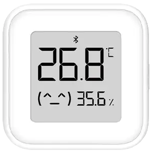

[README](./README_en.md) | [中文文档](./README.md)  

## DEV_XMWSDJ04MMC

把 [小米温湿度计 4](https://home.mi.com/webapp/content/baike/product/index.html?model=miaomiaoce.sensor_ht.t6#/) 添加到 HomeSpan，在 HomeKit 上显示温湿度的实现。

<p align="center">
  
</p>

下载 `DEV_XMWSDJ04MMC.h` 放在 HomeSpan 库文件的 `/ HomeSpan/src/` 文件夹下，在 HomeSpan 的代码添加如下头文件：

```C++
#include "DEV_XMWSDJ04MMC.h"
```

修改 `DEV_XMWSDJ04MMC.h` 中的更新时间参数（默认为7200000毫秒,即2小时更新一次）和蓝牙地址信息。

```C++
#define XIAOMI_LOOP_TIME 7200000  // 温湿度计2小时更新一次

#define BLE_DEVICE_ADDRESS "**:**:**:**:**:**"
```

在 `setup()` 函数中调用 `DEV_xiaomiTemp()`、`DEV_xiaomiHum()` 实现温湿度计功能（电池电量功能还在修改中），**HomeSpan 上电后需要按下小米温湿度计 4 的按钮以配对**。举例如下：

```C++
#include "HomeSpan.h"
#include "DEV_XMWSDJ04MMC.h"

void setup()
  {
    Serial.begin(115200);

    homeSpan.setWifiCredentials("your WIFI", "WIFI password");

    BLEDevice::init("");

    homeSpan.begin(Category::Bridges, "HomeKit Bridge", "Bridge", "ESP32-C3 mini"); 

    new SpanAccessory();
    new Service::AccessoryInformation();
    new Characteristic::Identify();

    new SpanAccessory();
    new Service::AccessoryInformation();
    new Characteristic::Identify();

    new DEV_XiaomiTemp();
    new DEV_XiaomiHum();

  }

  void loop()
  {

    homeSpan.poll();
    
  }

```
